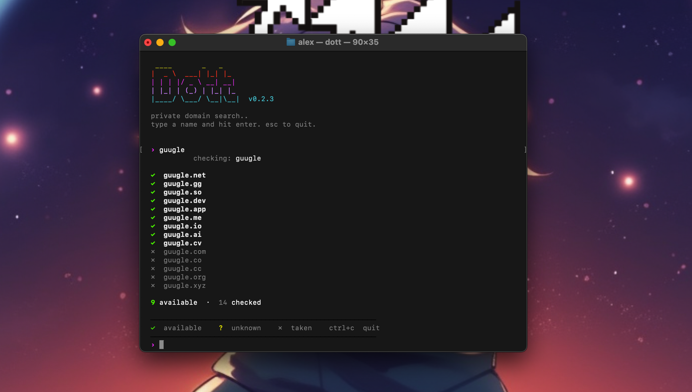

## About

Domain search tool for the terminal. Checks availability across 14 TLDs by querying RDAP, WHOIS, and DNS directly from your machine. No API keys, no middlemen, no tracking.

## Install

```sh
brew install yodatoshicom/dott/dott
```

Or with curl:
```sh
curl -fsSL https://raw.githubusercontent.com/yodatoshicom/dott/master/install.sh | sh
```

Or build from source:
```sh
cargo install dott
```

## Usage

```sh
dott              # interactive mode
dott myname       # check a name
dott myname -t com,io,dev   # specific TLDs
dott -s cool project        # suggest names from keywords
dott myname --plain         # machine-readable output
```

## How it works

Three checks run in parallel for each domain:

| Source | Method | What it tells you |
|--------|--------|-------------------|
| **RDAP** | HTTPS to registry | Status + registration/expiry dates |
| **WHOIS** | TCP port 43 | Status + registration/expiry dates |
| **DNS** | Cloudflare DoH | Whether NS records exist |

Results are merged (DNS > RDAP > WHOIS priority). Expiring domains are highlighted — orange under 90 days, yellow under a year.

## Supported TLDs

com, net, org, io, dev, app, co, ai, me, so, gg, cc, cv, xyz

## License

[MIT](LICENSE)
